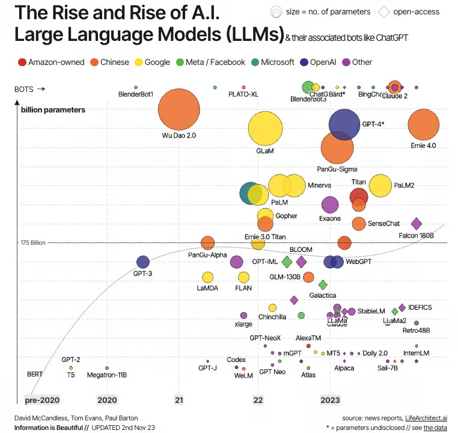

# transformers-exp
## introduction
- Transformers 库的主要概念
- Transformer 模型的工作原理 
- 如何使用 Hugging Face Hub 中的模型
- 如何在数据集上对其进行微调
- 如何在 Hub 上分享你的结果

## diving in
**Datasets** 和 **Tokenizers** 的基础知识

## advanced
超越 NLP，探讨如何使用 Transformer 模型解决语音处理和计算机视觉任务。
在此过程中，将学习如何构建和分享模型的演示，并将它们优化为生产环境。
完成这部分课程后，你将准备好将 **Transformers** 应用于（几乎）任何机器学习问题！

## Transformers 是语言模型
所有 Transformer 模型（GPT、BERT、BART、T5 等）都被训练为语言模型。这意味着他们已经以无监督学习的方式接受了大量原始文本的训练。无监督学习是一种训练类型，其中目标是根据模型的输入自动计算的。这意味着不需要人工来标记数据！

这种类型的模型可以对其训练过的语言有统计学的理解，但对于特定的实际任务的效果并不是很好。因此，一般的预训练模型会经历一个称为迁移学习（transfer learning）的过程。在此过程中，模型在给定任务上以监督方式（即使用人工注释标签）进行微调。

任务的一个例子是阅读 n 个单词的句子，预测下一个单词。这被称为**因果语言建模（causal language modeling）**，因为输出取决于过去和现在的输入，而不依赖于未来的输入。
另一个例子是**掩码语言建模（masked language modeling）**，俗称完形填空，该模型预测句子中的遮住的词。

## Transformer 是大模型
除了一些特例（如 DistilBERT）外，实现更好性能的一般策略是增加模型的大小以及预训练的数据量. 
训练模型，尤其是大型模型，需要大量的数据，时间和计算资源。它甚至会对环境产生影响.这就是为什么共享语言模型至关重要：共享经过训练的权重，当遇见新的需求时在预训练的权重之上进行微调，可以降低训练模型训练的算力和时间消耗，降低全球的总体计算成本和碳排放。
可以通过多种工具评估模型训练的碳排放(carbon/CO2 emmissions)。例如 ML CO2 Impact 或集成在 🤗 Transformers 中的 Code Carbon 

## Architecture
Encoder （左侧）：编码器接收输入并构建其表示（特征）。这意味着模型的使命是从输入中获取理解。
Decoder （右侧）：解码器使用编码器的表示（特征）以及其他输入来生成目标序列。这意味着模型的使命是生成输出。
这些部件中的每一个都可以独立使用，具体取决于任务：
Encoder-only 模型：适用于需要理解输入的任务，如句子分类和命名实体识别(NER)。
Decoder-only 模型：适用于生成任务，如文本生成。
Encoder-decoder 模型 或者 sequence-to-sequence 模型：适用于需要根据输入进行生成的任务，如翻译或摘要。

## Attention
Transformer 模型的一个关键特性是注意力层. 这一层将告诉模型在处理每个单词的表示时，对不同单词的**重视（忽略）程度**
考虑一个例子，假如我们要将英语翻译成法语。给定输入“You like this course”时，翻译模型需要注意相邻的词“You”，才能获得“like”的正确翻译，因为在法语中，动词“like”的变形依赖于主语。然而，对于那个词的翻译，句子的其余部分并没有用。同样，当翻译“this”时，模型也需要注意词“course”，因为“this”的翻译依赖于关联名词是单数还是复数。再次，句子中的其他词对于“course”的翻译并不重要。对于更复杂的句子（和更复杂的语法规则），模型可能需要特别注意可能在句子中更远处出现的词，以正确翻译每个词。

最初的 Transformer 架构如下所示，编码器位于左侧，解码器位于右侧:

注意，解码器块中的第一个注意力层关联到解码器的所有（过去的）输入，但是第二个注意力层只使用编码器的输出。因此，它在预测当前单词时，可以使用整个句子的信息。这是非常有用的，因因为不同的语言可以有把词放在不同顺序的语法规则，或者句子后面提供的一些上下文可能有助于确定给定单词的最佳翻译。
也可以在编码器/解码器中使用attention mask（注意力掩码层），以防止模型关注到某些特殊单词。例如，用于在批量处理句子时使所有输入长度一致的特殊填充词。

##Transformer 模型大体上可以分为三类：
GPT-like （也被称作自回归 Transformer 模型）
BERT-like （也被称作自动编码 Transformer 模型）
BART/T5-like （也被称作序列到序列的 Transformer 模型）

[DistilBert](image.png)
## Encoder Models
编码器模型仅使用 Transformer 模型的编码器部分。在每次计算过程中，注意力层都能访问整个句子的所有单词，这些模型通常具有“双向”（向前/向后）注意力，被称为自编码模型。
这些模型的预训练通常会使用某种方式破坏给定的句子（例如：通过随机遮盖其中的单词），并让模型寻找或重建给定的句子。
“编码器”模型适用于需要理解完整句子的任务，例如：句子分类、命名实体识别（以及更普遍的单词分类）和阅读理解后回答问题。
该系列模型的典型代表有：

ALBERT
BERT
DistilBERT
ELECTRA
RoBERTa

## Decoder Models
“解码器”模型仅使用 Transformer 模型的解码器部分。在每个阶段，对于给定的单词，注意力层只能获取到句子中位于将要预测单词前面的单词。这些模型通常被称为自回归模型。“解码器”模型的预训练通常围绕预测句子中的下一个单词进行。

这些模型最适合处理文本生成的任务。该系列模型的典型代表有：

CTRL
GPT
GPT-2
Transformer XL

## 
编码器-解码器模型（也称为序列到序列模型）同时使用 Transformer 架构的编码器和解码器两个部分。在每个阶段，编码器的注意力层可以访问输入句子中的所有单词，而解码器的注意力层只能访问位于输入中将要预测单词前面的单词。
这些模型的预训练可以使用训练编码器或解码器模型的方式来完成，但通常会更加复杂。例如， T5 通过用单个掩码特殊词替换随机文本范围（可能包含多个词）进行预训练，然后目标是预测被遮盖单词原始的文本。
序列到序列模型最适合于围绕根据给定输入生成新句子的任务，如摘要、翻译或生成性问答。
该系列模型的典型代表有：

BART
mBART
Marian
T5
##
模型	示例	任务
编码器	ALBERT，BERT，DistilBERT，ELECTRA，RoBERTa	句子分类、命名实体识别、抽取式问答（从文本中提取答案）
解码器	CTRL，GPT，GPT－2，Transformer XL	文本生成
编码器-解码器	BART，T5，Marian，mBART	文本摘要、翻译、生成式问答（生成问题的回答类似 chatgpt）

#
https://huggingface.co/learn/nlp-course/zh-CN/chapter1/10?fw=pt
